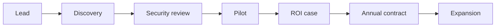

# Monetization Strategy and GTM Roadmap

## Audience and assumptions

- Target buyer: Corporate L&D leadership with enterprise procurement processes.
- Sales motion: Sales-led annual contracts with pilot-based validation.
- Compliance: SOC2 expectations plus SSO and LMS integrations (SCORM and LTI).

## Value proposition for Corporate L&D

### Primary outcomes to sell

- Reduce time-to-competency via adaptive review scheduling and retention modeling.
- Improve retention and recertification outcomes with targeted spaced repetition.
- Lower training cost per learner by reducing re-training and seat time.

### Proof points to surface

- Retention lift and reduced forgetting velocity from pilot comparisons.
- Review efficiency gains and time saved per learner.

## Monetization model

### Pricing structure

- Platform fee plus per-learner annual fee with a minimum annual contract.
- Enterprise add-ons for compliance and integrations.

### Tiering strategy

| Tier | Positioning | Included capabilities |
| --- | --- | --- |
| Core | Mid-market L&D | Multi-tenant analytics, review queues, API access, basic dashboard, one LMS integration |
| Enterprise | Large L&D | Core plus SSO, SCIM, audit logging, advanced analytics, premium SLAs |
| Scale | Global orgs | Enterprise plus private deployment options, regional hosting, dedicated CS |

### Add-ons

- Additional LMS integrations: SCORM and LTI and xAPI bundles.
- Pilot Gate module for executive decisioning and ROI reporting.
- Private VPC or single-tenant deployment.
- Advanced analytics packs for cohort and role-based reporting.

## Thorough pricing examples

### Example 1: Mid-market L&D

- 5,000 learners
- Core Platform fee: 24,000 per year
- Per-learner fee: 15 per learner per year
- Annual total: 24,000 + 5,000 × 15 = 99,000

### Example 2: Enterprise L&D

- 15,000 learners
- Enterprise Platform fee: 60,000 per year
- Per-learner fee: 23 per learner per year
- Add-on: SCORM plus LTI bundle at 18,000 per year
- Annual total: 60,000 + 15,000 × 23 + 18,000 = 423,000

### Example 3: Global enterprise

- 40,000 learners
- Enterprise Platform fee: 60,000 per year
- Per-learner fee with volume discount: 18 per learner per year
- Add-on: Private VPC at 30,000 per year
- Annual total: 60,000 + 40,000 × 18 + 30,000 = 810,000

### Example 4: Pilot-to-expand

- Pilot phase for a limited learner cohort with defined success criteria
- Pilot fee: 25,000 credited at conversion
- Post-pilot expansion: 10,000 learners at Enterprise tier
- Annual total after credit: 60,000 + 10,000 × 23 - 25,000 = 265,000

## ROI narrative examples

### Example ROI calculation

- Learners: 10,000
- Training hours saved per learner: 2.5
- Cost per training hour: 60
- Annual savings: 10,000 × 2.5 × 60 = 1,500,000
- If annual contract is 300,000, ROI is 5:1 before indirect benefits.

### Example compliance case

- Reduced remediation and re-certification cycles
- Improved completion confidence through review scheduling
- Lower audit risk via analytics and documented learning outcomes

## Sales motion for Corporate L&D

### Target stakeholders

- Economic buyer: VP L&D or VP Talent
- Champions: Learning Ops and Curriculum Leads
- Gatekeepers: Security and IT

### Enterprise sales stages

1. Discovery and success criteria
2. Security review and compliance alignment
3. Pilot and ROI validation
4. Executive business case
5. Procurement and annual contract
6. Expansion by business unit and integration scope

## Product and operational prerequisites

### Compliance and security

- SOC2 readiness program with policies, controls, evidence, and audits
- SSO and SCIM provisioning
- Audit logs and data retention controls

### Integrations

- SCORM and LTI connectors with import and launch workflows
- xAPI support for interoperability where needed

### Enterprise readiness

- Admin console for orgs, roles, and usage
- SLAs and support tiers
- Data export and reporting

## GTM roadmap by quarter

### Q1: Enterprise readiness

- SSO and SCIM
- Basic SCORM or LTI integration
- SOC2 Type I program start and evidence collection
- Pilot analytics pack

### Q2: Expansion features

- Advanced analytics and cohort reporting
- Additional LMS integrations and xAPI
- Improved admin controls and audit logging

### Q3: Scale and reliability

- Private VPC or single-tenant deployment
- Regional hosting options
- Performance and reliability hardening

### Q4: Enterprise acceleration

- SOC2 Type II completion
- Partner ecosystem and reseller enablement
- Vertical playbooks for key industries

## Metrics to manage monetization

- ACV and ARR growth
- Pipeline conversion from pilot to annual
- Net revenue retention and expansion rate
- Time to launch for integrations
- Retention lift and review efficiency by cohort

## Decision points

- Select your initial pricing band and minimum contract size.
- Choose which integration to prioritize first for the first set of pilots.
- Define pilot success thresholds for executive sign-off.

## Implemented add-ons for the current B2B platform version

This version should include add-ons that accelerate buyer validation without requiring long enterprise procurement or security implementation cycles.

### Included now

- **Content/concept management**: tenant-owned learning concepts with prompts, answers, explanations, tags, source, difficulty, versioning, and active flags.
- **Pilot ROI reporting**: executive report generation based on learners, training hours saved, hourly cost, contract value, and live retention analytics.
- **CSV exports**: review queue, analytics, audit log, and ROI report exports for buyer sharing and spreadsheet workflows.
- **Audit logging**: organization, user, concept, attempt, daily-session, pilot, and ROI actions recorded for operational trust.
- **Explainable review queues**: each queue item includes reason codes and human-readable review rationale.

### Deferred enterprise add-ons

- SSO and SCIM should be added after the first paid pilots validate retention lift.
- SCORM, LTI, and xAPI should become paid integration add-ons once a target LMS segment is selected.
- Private VPC, regional hosting, and single-tenant deployment should remain enterprise-tier expansion features.
- Advanced analytics packs should be added after usage reveals which cohort/report views buyers request repeatedly.

## Separate product opportunities using the same stack

The same FastAPI, SQLite/Postgres, PyTorch, and Streamlit foundation can support separate projects without forcing this repository to become unfocused.

| Separate project | Use case | Reused components |
| --- | --- | --- |
| Daily Recall Learner App | Focused learner-facing product for daily review and habit formation | Daily session API, review queue, concept metadata, Streamlit/React frontend |
| LMS Retention Connector | API service that plugs into LMS platforms | Tenant store, attempts API, analytics exports, SCORM/LTI/xAPI adapters |
| Pilot Analytics Studio | Standalone product for proving training ROI and retention lift | Pilot cohorts, baseline capture, ROI reporting, CSV/PDF exports |
| AI Agent Memory API | Developer-facing memory and recall API for agents | Memory decay model, retrieval scoring, tenant isolation, FastAPI surface |

Keep these as separate repositories or packages if their buyer, roadmap, and UX diverge from the core B2B adaptive retention platform.
